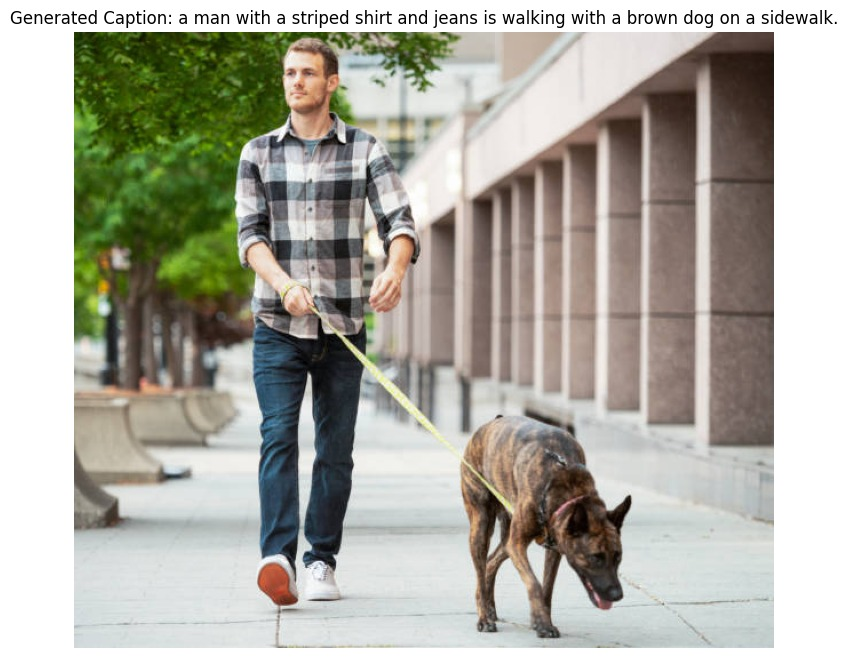
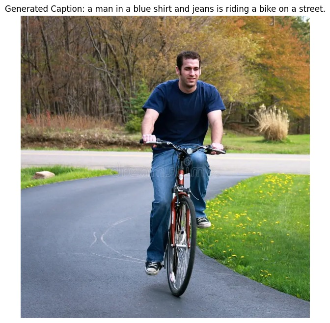

# Image Captioning Project

This project implements an image captioning model using a Vision Transformer (ViT) as the image encoder and a BERT-based model as the text decoder.

<p float="center">
  
  
</p>

## Setup

1. Clone the repository:
   ```
   git clone https://github.com/shravanbala/image-captioning.git
   cd image-captioning
   ```

2. Install the required packages:
   ```
   pip install -r requirements.txt
   ```

3. Download the Flickr30k dataset and place the images in the `data/flickr30k_images/` directory. Follow the below commands to create the necessary directory
```bash
mkdir -p data/flickr30k_images
```

4. Update the `configs/config.yaml` file with your specific settings.


## Usage

To train the model:
```bash
python main.py --mode train
```

To evaluate the model:
```bash
python main.py --mode evaluate
```

#### Evaluating the Model with Pretrained Checkpoint
1) Download the pretrained model checkpoint from the following link and place it in the `results/`  directory: [Pretrained Model Checkpoint](https://drive.google.com/file/d/1NNxWydu6kFrDwFgHceiDzxeg-uxtZNUY/view?usp=drive_link).

To create an new directory, follow the below commands
```bash
mkdir results
```

2) To evaluate the model using the pretrained checkpoint, run the following command:
 
``` bash
python main.py --mode evaluate 
```


## Project Structure

- `src/`: Contains the source code for the model, dataset, training, and evaluation.
- `configs/`: Contains configuration files.
- `data/`: Directory for storing the dataset (not tracked by git).
- `results/`: Directory for saving model checkpoints and evaluation results.
- `notebooks/`: Jupyter notebooks for exploratory data analysis.

## Future Improvements
1) Train with MSCOCO Dataset: Extend training to include the MSCOCO dataset, which provides a larger and more diverse set of images and captions.
2) Explore other architectures: Instead of the data hungry ViT, would like to experiment with Vision MAMBA model or try CNN-based backbone to extract features from images.

## License

This project is licensed under the MIT License - see the LICENSE file for details.